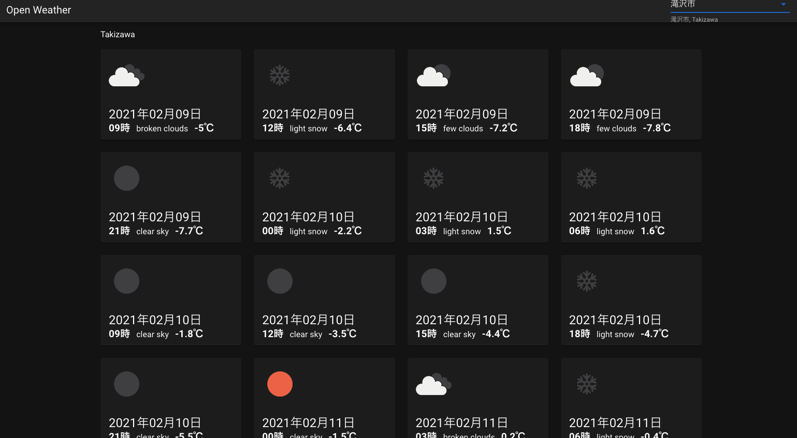

# my_weather

Open Weather の天気予報アプリ


[my_weather][1]

[1]:https://my-weather-reports.herokuapp.com/

## Build Setup

```bash
# install dependencies
$ yarn install

# serve with hot reload at localhost:3000
$ yarn dev

# build for production and launch server
$ yarn build
$ yarn start

# generate static project
$ yarn generate
```

## Heroku
```bash
$ heroku login
$ cd my_weather
$ heroku git:remote -a my-weather-reports

$ heroku config:set NPM_CONFIG_PRODUCTION=true
$ heroku config:set HOST=0.0.0.0
$ heroku config:set NODE_ENV=production

$ git add .
$ git commit ...
$ git push heroku master
```


For detailed explanation on how things work, check out [Nuxt.js docs](https://nuxtjs.org).
